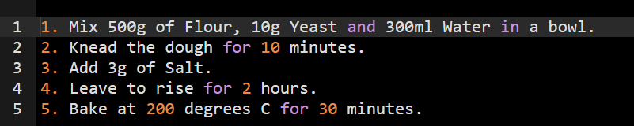
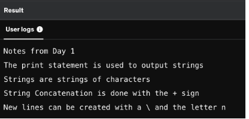
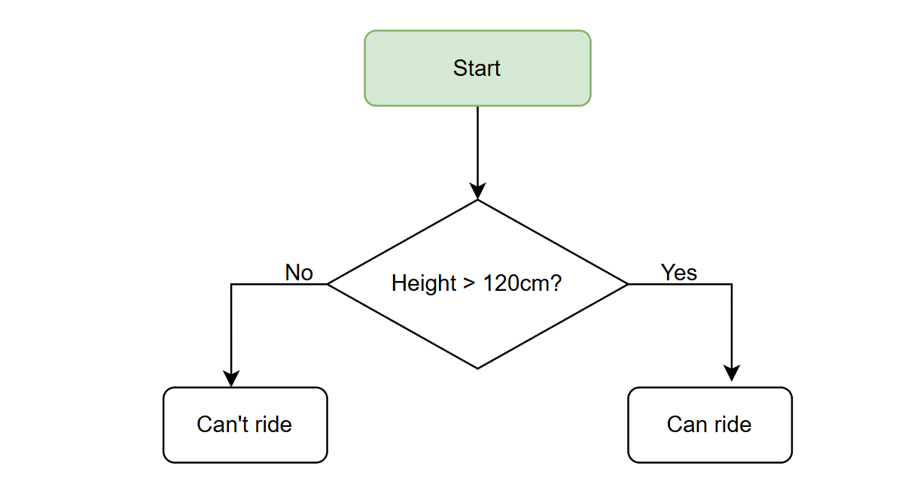
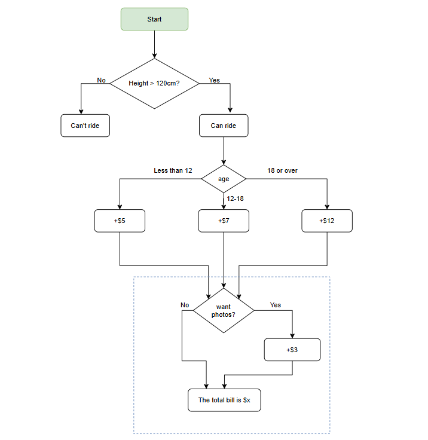

Printing Practice
Write a program that uses print statements to print the following recipe into the Output console. The text to print is already there, you just need to make it into code. Your code should print all five lines exactly the same as the example output below. Make sure that you don't change any of these existing text as everything, punctuation and casing all need to match!

Example Output


## 2.Debugging Practice
Look at the code in the code editor. There are errors on all 5 lines of code. Fix the code so that it runs without errors.

Try to run the code and debug each line using the error messages and feedback.

print(Notes from Day 1")
 print("The print statement is used to output strings")
print("Strings are strings of characters"
priint("String Concatenation is done with the + sign")
print(("New lines can be created with a \ and the letter n")

Example Output


## Variables
We have 2 variables glass1 and glass2. glass1 contains milk and glass2 contains juice. Write 3 lines of code to switch the contents of the variables. You are not allowed to type the words "milk" or "juice". You are only allowed to use variables to solve this exercise.

glass1="milk"
glass2="Juice"


BMI Calculator
The body mass index (BMI) is a measure used in medicine to see if someone is underweight or overweight. This is the formula used to calculate it:
bmi is equal to the person's weight divided by the person's height squared.
Convert this sentence into code on line 6.
height = 1.65 
weight = 84

# Write your code here.
# Calculate the bmi using weight and height.
bmi =

print(bmi)


## Tip Calculator
Welcome to the tip calculator!
What was the total bill? $
1200
How much tip would you like to give? 10, 12, or 15? 
11
How many people to split the bill?
3
Each person should pay: $444.00


## Tickecting





```python
def calculate_bill(height, age, want_photos):
    if height <= 120:
        return "Can't ride"

    # Base cost based on age
    if age < 12:
        bill = 5
    elif 12 <= age < 18:
        bill = 7
    else:  # 18 or over
        bill = 12

    # Add cost for photos
    if want_photos:
        bill += 3

    return f"The total bill is ${bill}"

# Example usage:
print(calculate_bill(height=130, age=10, want_photos=True))   # $8
print(calculate_bill(height=140, age=17, want_photos=False))  # $7
print(calculate_bill(height=150, age=20, want_photos=True))   # $15
print(calculate_bill(height=110, age=25, want_photos=True))   # Can't ride

```

BMI Calculator with Interpretations
Add some if/elif/else statements to the BMI calculator so that it interprets the BMI values calculated.

If the bmi is under 18.5 (not including), print out "underweight"

If the bmi is between 18.5 (including) and 25 (not including), print out "normal weight"

If the bmi is 25 (including) or over, print out "overweight"

```python
weight = 85
height = 1.85

bmi = weight / (height ** 2)

if bmi<18.85:
 print("underweight")
elif  bmi >=18.5:
  print("normal weight")
else:
 print("overweight")

```


