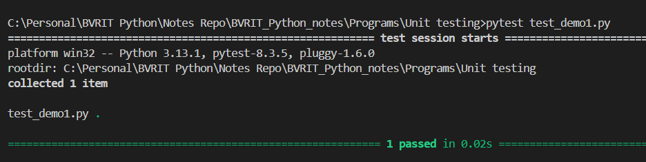
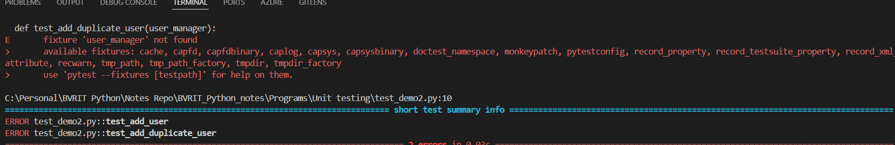
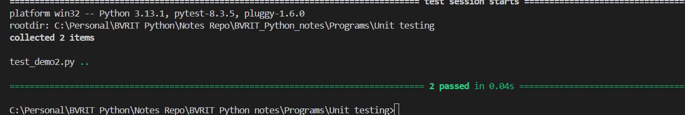
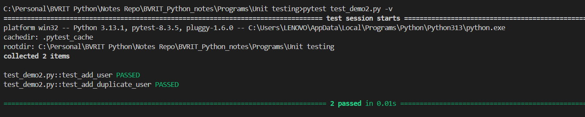
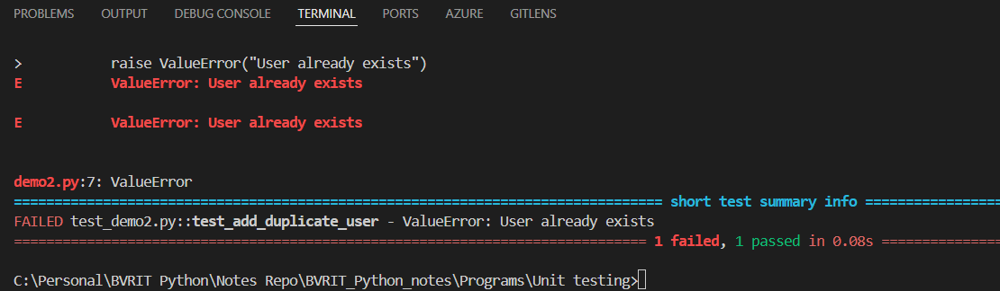

 check the Version of Pytest
` pytest --version`

 If it is not installeduse the below command to install the pytest

 `pip install pytest`

 check the version

 ### create a new file (demo1.py)
 ```python
    def get_weather(temp):
    if temp < 0:
        return "Freezing"
    elif 0 <= temp < 20:
        return "Cold"
    elif 20 <= temp < 30:
        return "Warm"
    else:
        return "Hot"
 ```
 ### create another file (test_demo1.py)
 ```python
import pytest
from demo1 import get_weather
def test_get_weather():
    assert get_weather(-5) == "Freezing"
    assert get_weather(0) == "Cold"
    assert get_weather(15) == "Cold"
    assert get_weather(20) == "Warm"
    assert get_weather(25) == "Warm"
    assert get_weather(30) == "Hot"
    assert get_weather(35) == "Hot"
 ```

## How to run the test
 goto terminal
` pytest test_demo1.py`



### Another Example

demo2.py
```python
class UserManager:
    def __init__(self):
        self.users = {}

    def add_user(self, username, email):
        if username in self.users:
            raise ValueError("User already exists")
        self.users[username] = email
        return True

    def get_user(self, username):
        if username not in self.users:
            raise ValueError("User not found")
        return self.users[username] 
```

test_demo2.py

```python
import pytest
from demo2 import UserManager
def user_manager():
    "creates fresh instance of UserManager before each test."
    return UserManager()
def test_add_user(user_manager):
    assert user_manager.add_user("geetha", "geetha@mail.com") == True
    assert user_manager.get_user("geetha") == "geetha@mail.com"
    
def test_add_duplicate_user(user_manager):
    user_manager.add_user("geetha", "geetha@mail.com")  
    with pytest.raises(ValueError, match="User already exists"):
        user_manager.add_user("geetha", "geetham@mail.com")  
```

Run the Test


Error :fixture UserManager Not Found

Add the below line of code above def user_manager().it act as setup in other unit test.
@pytest.fixture

Run the test


`pytest test_demo2.py -v`


Now let us comment the fixture area and create 
an instance for UserManager

user_manager=UserManager()
```python
import pytest
from demo2 import UserManager
# @pytest.fixture
# def user_manager():
#     "creates fresh instance of UserManager before each test."
#     return UserManager()

user_manager = UserManager() #instance of UserManager
Now change the code as below and run the test
```python
import pytest
from demo2 import UserManager
# @pytest.fixture
# def user_manager():
#     "creates fresh instance of UserManager before each test."
#     return UserManager()

user_manager = UserManager() #instance of UserManager
def test_add_user():
    assert user_manager.add_user("geetha", "geetha@mail.com") == True
    assert user_manager.get_user("geetha") == "geetha@mail.com"
    
def test_add_duplicate_user():
    user_manager.add_user("geetha", "geetha@mail.com")  
    with pytest.raises(ValueError):
        user_manager.add_user("geetha", "geetham@mail.com")  
```
Now you will get the error


As we removed Fixture instance is not create before each test. Instance created once and added user and then running second (add_duplicate_user) it considered user added already show it shows as error

Now hope you understand the use of fixture
Now you can modify the code as early
